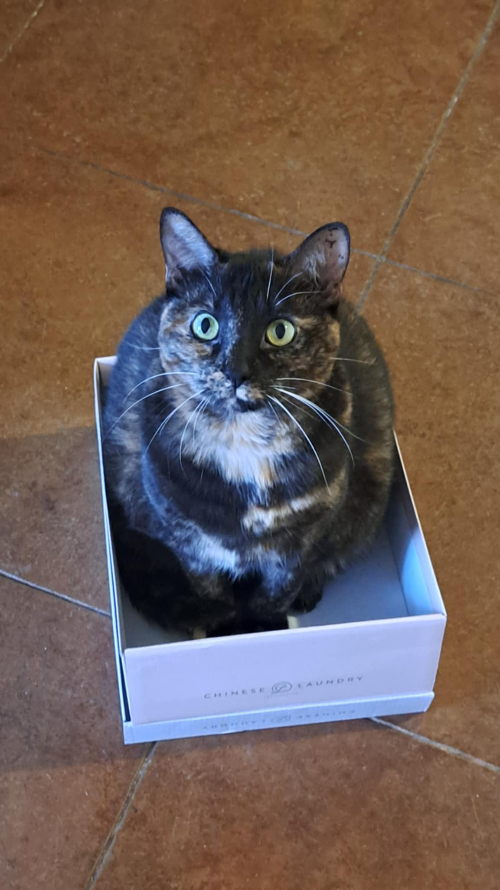

### PythonExperiments    

###### This respository was created as part of the DSCI 8133 class, *Foundations of Data Science*, that I am enrolled in at Mississippi State University. I am a part of the Spring 2025 semester, and this will be my *second* Master's Degree.
---
## Plan 
I plan to use this repository to keep track of my growth with Python using a [Jupyter](https://jupyter.org/) notebook. More projects and sample data files are to come. Eventually, I plan to use another respository to track my progress with R as well. 

## About Me 
My name is Mackenzie Traylor and I work in the College of Forest Resources at Mississippi State University as a **Service Desk Specialist I** which basically means I am first level computer support. I help users when their computers don't work the way they intended. I am enrolled in the **Data Science** program at MSU, and I'm really enjoying it so far. It's different from my previous master's, which is in Library and Information Science, but there are some similarities:
- Ethics of data collection is still a hot topic in this field
- Learning to code or program is an important part of the field (I learned a little HTML in my previous degree)
- Data privacy is still important. For the library field, patron privacy was tantamount. For this, it seems that security of data is at the utmost importance

I chose this photograph because I love it. It is a picture my roommate took of my cat, Sprat. She was named after a book character (and a species of tiny fish). She climbed into this shoe box almost as soon as it was emptied.

